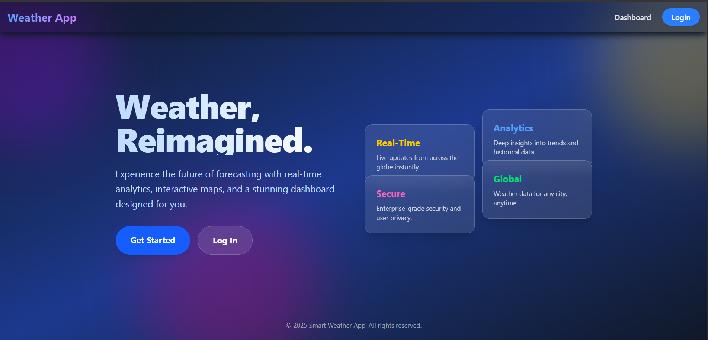

# WeatherApp

;; 


## 🚀 Live Demo

👉 https://kalavastha-application.netlify.app/

## Overview

**WeatherApp** is a modern, responsive web application that provides real‑time weather information, forecasts, and analytics. Built with a **React** frontend and a **Node.js/Express** backend, it showcases a premium glassmorphism UI, dynamic charts, and user authentication. The app integrates with external weather APIs and offers a clean, modular architecture for easy extension.

---

## Features

- **Real‑time weather data** for any location
- **7‑day forecast** with interactive charts
- **User authentication** (login, registration, JWT protected routes)
- **Dashboard** with glassmorphism design and smooth micro‑animations
- **Responsive layout** for desktop, tablet, and mobile
- **Theme toggling** (light/dark) with context API
- **Admin panel** for managing users and data
- **Modular codebase** with clear separation of concerns (frontend, backend, middleware)

---

## Tech Stack

| Layer               | Technology                                                                               |
| ------------------- | ---------------------------------------------------------------------------------------- |
| **Frontend**        | React 18, Vite, JavaScript, CSS (custom design system), Chart.js, React Router ,Tailwind |
| **Backend**         | Node.js, Express, JavaScript, JWT, Multer (file uploads)                                 |
| **APIs**            | OpenWeatherMap (weather data), custom internal APIs                                      |
| **Version Control** | Git, GitHub                                                                              |
| **Deployment**      | Netlify (frontend) + Render (backend)                                                    |

---

## Getting Started

### Prerequisites

- **Node.js** (v18 or later) and **npm**
- **Git**
- An **OpenWeatherMap API key** (sign up at https://openweathermap.org/api)

### Installation

```bash
# Clone the repository
git clone https://github.com/athul457/Weather-app
cd WeatherApp/weatherApp

# Install frontend dependencies
cd frontend
npm install

# Install backend dependencies
cd ../backend
npm install
```

### Environment Variables

Create a `.env` file in the `backend` directory with the following keys:

```dotenv
PORT=3224
JWT_SECRET=your_jwt_secret
OPENWEATHER_API_KEY=your_openweather_api_key
```

### Running the Application

```bash
# Start the backend (in a terminal)

cd backend
npm run dev

# Start the frontend (in another terminal)
cd ../frontend
npm run dev
```

The frontend will be available at `http://localhost:5173` and the backend at `http://localhost:3224`.

---

## Project Structure

```
weatherApp/
├─ backend/                 # Express server
│  ├─ routes/               # API route definitions
│  ├─ middlewares/          # Custom middlewares (e.g., upload, auth)
│  ├─ models/               # Data models (if using a DB)
│  └─ .env                  # Environment variables (not committed)
├─ frontend/                # Vite + React application
│  ├─ src/
│  │  ├─ components/        # Reusable UI components
│  │  ├─ pages/             # Page components (Home, Login, Dashboard)
│  │  ├─ contexts/          # React Contexts (Auth, Theme, Weather)
│  │  └─ App.jsx
│  └─ index.html
└─ README.md                # This file
```

---

## Contributing

Contributions are welcome! Please follow these steps:

1. Fork the repository.
2. Create a feature branch (`git checkout -b feature/your-feature`).
3. Commit your changes with clear messages.
4. Push to your fork and open a Pull Request.
5. Ensure linting and tests (if any) pass.

---

## License

This project is licensed under the **MIT License** – see the [LICENSE](LICENSE) file for details.

---

## Acknowledgements

- **OpenWeatherMap** for providing reliable weather data.
- **Chart.js** for beautiful data visualisation.
- Inspiration from modern UI design trends (glassmorphism, micro‑animations).
